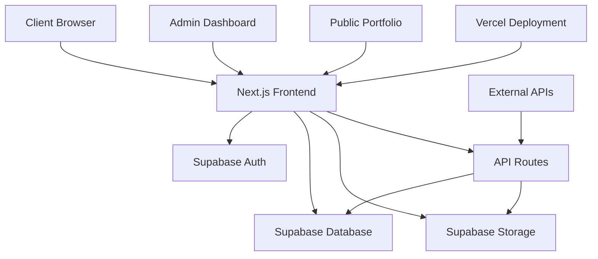

# Wolf Studio - Digital Portfolio & Business Platform

<div align="center">
  
  
  **Digital portfolio and business platform for Wolf Studio - CBRE's workplace design firm**
  
  [](https://nextjs.org/)
  [](https://www.typescriptlang.org/)
  [](https://supabase.com/)
  [](https://tailwindcss.com/)
</div>

## Table of Contents

1. [Project Overview](#project-overview)
2. [Architecture](#architecture)
3. [Features](#features)
4. [Prerequisites](#prerequisites)
5. [Installation](#installation)
6. [Configuration](#configuration)
7. [Deployment](#deployment)
8. [Database Setup](#database-setup)
9. [Security](#security)
10. [API Documentation](#api-documentation)
11. [Contributing](#contributing)
12. [Support](#support)

---

## Project Overview

Wolf Studio is a renowned workplace design firm under CBRE, specializing in transforming offices into places that bring joy and fulfillment to people at work. Based in Singapore and Hong Kong, Wolf Studio believes in creating workplaces that help organizations grow while making the design journey delightful and rewarding for their clients.

This website serves as Wolf Studio's digital portfolio and business platform, equipped with enterprise-grade portfolio management capabilities. It showcases their extensive work in workplace design, their team, and their services, while providing a robust admin dashboard for managing projects, users, and content.

### About Wolf Studio

Wolf Studio stands firm in their belief of creating "a world where everyone loves going to work." With over 75 years of collective workplace design experience, they have transformed more than 10 million square feet of office space across 750+ client projects over the last 10 years.

**Key Services:**
- Design Consultancy
- Design & Build
- Feasibility Studies  
- Visual Content

**Locations:**
- **Singapore Industrial Studio**: 61 Ubi Road 1 #04-21/22, Singapore 408727
- **Singapore CBD Studio**: 6 Battery Rd, #32-01, Singapore 049909
- **Hong Kong Studio**: Level 27, One Pacific Place, 88 Queensway, Admiralty, Hong Kong

### Technology Platform Capabilities

This website provides Wolf Studio with a comprehensive digital platform featuring:

- **Project Portfolio Management**: Complete showcase of their workplace design projects
- **Client Relationship Management**: Tools for managing client projects and relationships
- **Content Management System**: Rich content management for project descriptions and media
- **Team Management**: Showcase of team members and their expertise
- **Business Analytics**: Insights into project performance and client engagement
- **Enterprise Security**: Robust security measures for client data protection

### Key Capabilities

- **Project Portfolio Showcase**: Complete showcase of Wolf Studio's workplace design projects
- **Client Project Management**: Tools for managing design projects and client relationships
- **Design Content Management**: Rich content management for project descriptions, images, and case studies
- **Team Showcase**: Professional presentation of Wolf Studio's design team and expertise
- **Business Analytics**: Insights into project performance and client engagement
- **Multi-Brand Support**: Support for both Wolf Studio and CBRE branding
- **Enterprise Security**: Robust security measures for client data and project confidentiality

### Technology Stack

- **Frontend**: Next.js 15 with App Router, React 18, TypeScript
- **Database**: Supabase (PostgreSQL) with real-time subscriptions
- **Authentication**: Supabase Auth with JWT tokens
- **Storage**: Supabase Storage for file management
- **Styling**: Tailwind CSS with custom design system
- **Deployment**: Vercel with CI/CD pipeline
- **Monitoring**: Built-in performance and error tracking

---

## Architecture

### System Architecture



### Application Structure

```
wolf-studio/
├── app/                         # Next.js App Router
│   ├── admin/                   # Admin dashboard routes
│   │   ├── analytics/           # Analytics dashboard
│   │   ├── categories/          # Category management
│   │   ├── projects/            # Project management
│   │   ├── settings/            # System settings
│   │   └── users/               # User management
│   ├── api/                     # API routes
│   │   └── admin/               # Admin API endpoints
│   └── wolf-studio/             # Public portfolio site
│       └── our-work/            # Project showcase
├── components/                  # Reusable UI components
│   ├── admin/                   # Admin-specific components
│   ├── common/                  # Shared components
│   ├── cbre/                    # CBRE-branded components
│   └── ui/                      # Base UI components
├── lib/                         # Utility libraries
│   ├── auth/                    # Authentication utilities
│   ├── hooks/                   # Custom React hooks
│   ├── services/                # API service layers
│   ├── supabase/                # Supabase configuration
│   ├── types/                   # TypeScript definitions
│   └── utils/                   # Helper utilities
├── public/                      # Static assets
├── supabase/                    # Database migrations
└── docs/                        # Documentation
```

### Data Flow

1. **Authentication Flow**: User login → Supabase Auth → JWT token → Protected routes
2. **Data Operations**: Component → Service layer → Supabase client → Database
3. **File Uploads**: User upload → API route → Supabase Storage → Database record
4. **Real-time Updates**: Database change → Supabase subscription → Component update

---

## Features

### Admin Dashboard
- **🏠 Dashboard**: Business overview and project statistics
- **👥 User Management**: Team member and client user administration
- **📁 Project Management**: Complete project lifecycle management for design projects
- **🏷️ Category Management**: Organize projects by service type and industry
- **📊 Analytics**: Real-time business metrics and project performance tracking
- **⚙️ Settings**: Platform configuration and Wolf Studio branding
- **📈 Storage Monitor**: Design asset management and optimization

### Public Portfolio Website
- **🎨 Project Showcase**: Beautifully designed galleries of Wolf Studio's workplace projects
- **📱 Responsive Design**: Mobile-first responsive layout optimized for all devices
- **🚀 Performance Optimized**: Fast loading with lazy loading and image optimization
- **♿ Accessibility**: WCAG 2.1 compliant interface for inclusive access
- **🔍 SEO Optimized**: Search engine optimized for business visibility

### Core Features
- **🔐 Authentication**: Secure login with session management for team and client access
- **🔒 Authorization**: Role-based access control (RBAC) for different user types
- **📁 Design Asset Management**: Upload, organize, and optimize project images and documents
- **📝 Rich Content Editor**: WYSIWYG editor for project descriptions and case studies
- **🎭 Multi-Brand Support**: Support for both Wolf Studio and CBRE branding themes
- **🔧 Error Handling**: Comprehensive error boundaries and logging for reliability
- **📊 Performance Monitoring**: Real-time performance tracking and optimization
- **🚨 Security Monitoring**: Enterprise-grade security logging and alerts
- **🔍 Health Monitoring**: Comprehensive system health checks and monitoring
- **📈 Business Analytics**: Real-time project metrics and client engagement insights
- **🔄 Request Tracing**: Correlation IDs for debugging and system monitoring
- **⚡ Web Vitals**: Client-side performance metrics for optimal user experience

---

## Prerequisites

### System Requirements

- **Node.js**: 18.0 or higher
- **npm**: 8.0 or higher (or yarn 3.0+)
- **Git**: Latest version
- **Browser**: Modern browser with ES2020 support

### Development Tools

- **VS Code**: Recommended IDE with extensions:
  - ES7+ React/Redux/React-Native snippets
  - TypeScript Importer
  - Tailwind CSS IntelliSense
  - ESLint
  - Prettier

### External Services

- **Supabase Account**: For database and authentication
- **Vercel Account**: For deployment (recommended)
- **Domain**: For custom domain configuration

---

## Installation

### Quick Start

```bash
# Clone the repository
git clone https://github.com/your-org/wolf-studio.git
cd wolf-studio

# Install dependencies
npm install

# Set up environment variables
cp .env.example .env.local

# Run the development server
npm run dev
```

### Detailed Setup

1. **Clone and Install**
   ```bash
   git clone https://github.com/your-org/wolf-studio.git
   cd wolf-studio
   npm install
   ```

2. **Environment Configuration**
   ```bash
   # Copy environment template
   cp .env.example .env.local
   
   # Edit environment variables
   nano .env.local
   ```

3. **Database Setup**
   ```bash
   # Run database migrations
   npm run db:migrate
   
   # Seed initial data
   npm run db:seed
   ```

4. **Start Development Server**
   ```bash
   npm run dev
   ```

5. **Access the Application**
   - Admin Dashboard: `http://localhost:3000/admin`
   - Public Portfolio: `http://localhost:3000/wolf-studio`

---

## Configuration

### Environment Variables

#### Required Variables
```env
# Supabase Configuration
NEXT_PUBLIC_SUPABASE_URL=your_supabase_url
NEXT_PUBLIC_SUPABASE_ANON_KEY=your_supabase_anon_key
SUPABASE_SERVICE_ROLE_KEY=your_supabase_service_role_key

# Application Configuration
NEXTAUTH_URL=http://localhost:3000
NEXTAUTH_SECRET=your_nextauth_secret

# Optional: Custom Configuration
NEXT_PUBLIC_APP_NAME="Wolf Studio"
NEXT_PUBLIC_APP_URL="https://your-domain.com"
```

#### Development Variables
```env
# Development Only
NODE_ENV=development
NEXT_PUBLIC_DEBUG=true
NEXT_PUBLIC_ENABLE_ANALYTICS=false
```

#### Production Variables
```env
# Production Only
NODE_ENV=production
NEXT_PUBLIC_DEBUG=false
NEXT_PUBLIC_ENABLE_ANALYTICS=true
NEXT_PUBLIC_SENTRY_DSN=your_sentry_dsn

# Monitoring & APM
NEXT_PUBLIC_DATADOG_TOKEN=your_datadog_token
NEXT_PUBLIC_NEWRELIC_LICENSE_KEY=your_newrelic_key
NEXT_PUBLIC_LOGROCKET_APP_ID=your_logrocket_id

# Security Configuration
SECURITY_RATE_LIMIT_MAX=100
SECURITY_RATE_LIMIT_WINDOW=900000
SECURITY_CSRF_SECRET=your_csrf_secret
SECURITY_IP_WHITELIST=127.0.0.1,::1
SECURITY_BLOCKED_IPS=suspicious.ip.1,suspicious.ip.2

# Performance Monitoring
PERFORMANCE_API_THRESHOLD=1000
PERFORMANCE_DB_THRESHOLD=500
PERFORMANCE_MEMORY_THRESHOLD=80
PERFORMANCE_ERROR_RATE_THRESHOLD=0.05
```

### Application Configuration

#### Database Configuration
```typescript
// lib/supabase/config.ts
export const supabaseConfig = {
  url: process.env.NEXT_PUBLIC_SUPABASE_URL!,
  anonKey: process.env.NEXT_PUBLIC_SUPABASE_ANON_KEY!,
  serviceRoleKey: process.env.SUPABASE_SERVICE_ROLE_KEY!,
}
```

#### Authentication Configuration
```typescript
// lib/auth/config.ts
export const authConfig = {
  pages: {
    signIn: '/admin/login',
    error: '/admin/error',
  },
  session: {
    strategy: 'jwt',
    maxAge: 24 * 60 * 60, // 24 hours
  },
}
```

### Brand Configuration

#### Wolf Studio Theme
```typescript
// config/theme.ts
export const wolfStudioTheme = {
  colors: {
    primary: '#000000',
    secondary: '#666666',
    accent: '#ff6b35',
  },
  fonts: {
    primary: 'Calibre',
    secondary: 'Financier Display',
  },
}
```

#### CBRE Theme
```typescript
// config/cbre-theme.js
export const cbreTheme = {
  colors: {
    primary: '#00A14B',
    secondary: '#004225',
    accent: '#7ED321',
  },
  fonts: {
    primary: 'Noto Sans',
    secondary: 'Space Mono',
  },
}
```

---

## Deployment

### Vercel Deployment (Recommended)

#### Automatic Deployment
```bash
# Install Vercel CLI
npm install -g vercel

# Deploy to Vercel
vercel --prod

# Configure environment variables
vercel env add NEXT_PUBLIC_SUPABASE_URL
vercel env add NEXT_PUBLIC_SUPABASE_ANON_KEY
vercel env add SUPABASE_SERVICE_ROLE_KEY
```

#### Manual Configuration
1. Connect your GitHub repository to Vercel
2. Set up environment variables in Vercel dashboard
3. Configure custom domain and SSL
4. Set up deployment hooks for CI/CD

### Alternative Deployment Options

#### Docker Deployment
```dockerfile
# Dockerfile
FROM node:18-alpine

WORKDIR /app
COPY package*.json ./
RUN npm ci --only=production

COPY . .
RUN npm run build

EXPOSE 3000
CMD ["npm", "start"]
```

```bash
# Build and run Docker container
docker build -t wolf-studio .
docker run -p 3000:3000 wolf-studio
```

#### AWS Deployment
```bash
# Using AWS Amplify
npm install -g @aws-amplify/cli
amplify init
amplify add hosting
amplify publish
```

#### Azure Deployment
```bash
# Using Azure Static Web Apps
npm install -g @azure/static-web-apps-cli
swa init
swa deploy
```

### CI/CD Pipeline

#### GitHub Actions
```yaml
# .github/workflows/deploy.yml
name: Deploy to Production

on:
  push:
    branches: [main]

jobs:
  deploy:
    runs-on: ubuntu-latest
    steps:
      - uses: actions/checkout@v3
      - uses: actions/setup-node@v3
        with:
          node-version: '18'
      - run: npm ci
      - run: npm run build
      - run: npm run test
      - uses: amondnet/vercel-action@v20
        with:
          vercel-token: ${{ secrets.VERCEL_TOKEN }}
          vercel-org-id: ${{ secrets.VERCEL_ORG_ID }}
          vercel-project-id: ${{ secrets.VERCEL_PROJECT_ID }}
```

---

## Database Setup

### Supabase Setup

#### 1. Create Supabase Project
```bash
# Create new project at https://supabase.com/dashboard
# Note your project URL and anon key
```

#### 2. Run Migrations
```sql
-- supabase/migrations/20241201000001_initial_schema.sql
-- This file contains the initial database schema
-- Run migrations through Supabase dashboard or CLI
```

#### 3. Set up Row Level Security (RLS)
```sql
-- Enable RLS on all tables
ALTER TABLE projects ENABLE ROW LEVEL SECURITY;
ALTER TABLE categories ENABLE ROW LEVEL SECURITY;
ALTER TABLE users ENABLE ROW LEVEL SECURITY;

-- Create policies
CREATE POLICY "Public projects are viewable by everyone"
  ON projects FOR SELECT
  USING (is_published = true);

CREATE POLICY "Users can manage their own projects"
  ON projects FOR ALL
  USING (auth.uid() = user_id);
```

### Alternative Database Setup

#### PostgreSQL Setup
```bash
# Install PostgreSQL
sudo apt install postgresql postgresql-contrib

# Create database and user
sudo -u postgres psql
CREATE DATABASE wolf_studio;
CREATE USER wolf_studio WITH PASSWORD 'your_password';
GRANT ALL PRIVILEGES ON DATABASE wolf_studio TO wolf_studio;
```

#### MySQL Setup
```bash
# Install MySQL
sudo apt install mysql-server

# Create database and user
mysql -u root -p
CREATE DATABASE wolf_studio;
CREATE USER 'wolf_studio'@'localhost' IDENTIFIED BY 'your_password';
GRANT ALL PRIVILEGES ON wolf_studio.* TO 'wolf_studio'@'localhost';
```

### Database Schema

#### Core Tables
- **users**: User accounts and profiles
- **projects**: Portfolio projects and metadata
- **categories**: Project categorization
- **project_images**: Image assets and metadata
- **user_sessions**: Session management
- **activity_logs**: Audit trail and user actions

#### Relationships
```sql
-- Projects belong to categories
projects.category_id → categories.id

-- Projects have many images
project_images.project_id → projects.id

-- Users can manage multiple projects
projects.user_id → users.id
```

---

## Security

### Authentication & Authorization

#### JWT Token Management
```typescript
// lib/auth/jwt.ts
export const tokenConfig = {
  secret: process.env.NEXTAUTH_SECRET!,
  expiration: '24h',
  refreshThreshold: '1h',
}
```

#### Role-Based Access Control
```typescript
// lib/auth/rbac.ts
export const roles = {
  ADMIN: 'admin',
  EDITOR: 'editor',
  VIEWER: 'viewer',
} as const

export const permissions = {
  MANAGE_USERS: 'manage_users',
  MANAGE_PROJECTS: 'manage_projects',
  VIEW_ANALYTICS: 'view_analytics',
}
```

### Input Validation

#### Schema Validation
```typescript
// lib/validation/schemas.ts
import { z } from 'zod'

export const ProjectSchema = z.object({
  title: z.string().min(1).max(100),
  description: z.string().max(1000).optional(),
  category: z.string().uuid(),
  images: z.array(z.object({
    url: z.string().url(),
    alt: z.string().max(255),
  })),
})
```

#### API Validation
```typescript
// app/api/projects/route.ts
import { ProjectSchema } from '@/lib/validation/schemas'

export async function POST(request: Request) {
  try {
    const body = await request.json()
    const validatedData = ProjectSchema.parse(body)
    // Process validated data
  } catch (error) {
    return NextResponse.json(
      { error: 'Invalid input data' },
      { status: 400 }
    )
  }
}
```

### Security Headers

#### Next.js Security Configuration
```typescript
// next.config.js
const securityHeaders = [
  {
    key: 'X-Frame-Options',
    value: 'DENY',
  },
  {
    key: 'X-Content-Type-Options',
    value: 'nosniff',
  },
  {
    key: 'Referrer-Policy',
    value: 'strict-origin-when-cross-origin',
  },
  {
    key: 'Content-Security-Policy',
    value: "default-src 'self'; script-src 'self' 'unsafe-inline';",
  },
]
```

### Environment Security

#### Secret Management
```bash
# Use environment variables for secrets
export SUPABASE_SERVICE_ROLE_KEY="your_secret_key"
export NEXTAUTH_SECRET="your_nextauth_secret"

# Never commit secrets to version control
echo "*.env*" >> .gitignore
```

#### Production Security Checklist
- [ ] Enable HTTPS/TLS encryption
- [ ] Configure security headers
- [ ] Implement rate limiting
- [ ] Enable database encryption
- [ ] Set up monitoring and alerts
- [ ] Regular security audits
- [ ] Dependency vulnerability scanning

---

## Monitoring & Observability

### Structured Logging

#### Log Levels and Categories
```typescript
// lib/services/logger.ts
export enum LogLevel {
  ERROR = 'error',
  WARN = 'warn',
  INFO = 'info',
  DEBUG = 'debug',
  AUDIT = 'audit',
  SECURITY = 'security',
  PERFORMANCE = 'performance'
}

export enum LogCategory {
  AUTH = 'auth',
  API = 'api',
  DATABASE = 'database',
  SECURITY = 'security',
  PERFORMANCE = 'performance',
  USER_ACTION = 'user_action',
  SYSTEM = 'system',
  ERROR = 'error',
  AUDIT = 'audit',
  MIDDLEWARE = 'middleware'
}
```

#### Request Tracing
```typescript
// Automatic correlation ID generation
import { logger } from '@/lib/services/logger'

// Every request gets a unique correlation ID
const correlationId = logger.generateCorrelationId()

// All logs include correlation ID for tracing
logger.info('User login attempt', {
  correlationId,
  userId: 'user123',
  ipAddress: '192.168.1.1'
})
```

### Performance Monitoring

#### API Performance Tracking
```typescript
// lib/services/performance-monitor.ts
import { performanceMonitor } from '@/lib/services/performance-monitor'

// Track API response times
performanceMonitor.trackAPIRequest({
  endpoint: '/api/projects',
  method: 'GET',
  statusCode: 200,
  duration: 150,
  responseSize: 1024,
  timestamp: new Date()
})
```

#### Database Performance
```typescript
// Track database query performance
performanceMonitor.trackDatabaseQuery({
  query: 'SELECT * FROM projects WHERE category_id = ?',
  duration: 45,
  rows: 25,
  cached: false,
  timestamp: new Date()
})
```

#### Web Vitals Collection
```typescript
// Client-side performance metrics
import { webVitalsTracker } from '@/lib/services/performance-monitor'

// Automatically track Core Web Vitals
webVitalsTracker.track('FCP', 1200, 'unique-id', 100, 'good')
webVitalsTracker.track('LCP', 2500, 'unique-id', 200, 'needs-improvement')
webVitalsTracker.track('CLS', 0.1, 'unique-id', 0.05, 'good')
```

### Security Event Logging

#### Authentication Events
```typescript
// Log authentication events
logger.logSecurity({
  eventType: 'login',
  userId: 'user123',
  ipAddress: '192.168.1.1',
  userAgent: 'Mozilla/5.0...',
  details: { loginMethod: 'password' },
  severity: 'low'
})

// Log failed login attempts
logger.logSecurity({
  eventType: 'failed_login',
  ipAddress: '192.168.1.1',
  userAgent: 'Mozilla/5.0...',
  details: { reason: 'invalid_credentials', attempts: 3 },
  severity: 'medium'
})
```

#### Rate Limiting Events
```typescript
// Log rate limit violations
logger.logSecurity({
  eventType: 'rate_limit',
  ipAddress: '192.168.1.1',
  userAgent: 'Mozilla/5.0...',
  details: { 
    endpoint: '/api/projects',
    attempts: 150,
    timeWindow: '15min'
  },
  severity: 'high'
})
```

### Health Monitoring

#### System Health Checks
```http
GET /api/health
```

**Response:**
```json
{
  "status": "healthy",
  "timestamp": "2024-01-01T00:00:00Z",
  "uptime": 3600,
  "responseTime": 45,
  "checks": {
    "database": {
      "status": "healthy",
      "responseTime": 25,
      "details": { "connected": true }
    },
    "performance": {
      "status": "healthy",
      "details": {
        "errorRate": 0.001,
        "memoryUsagePercent": 65,
        "requestCount": 1250
      }
    },
    "memory": {
      "status": "healthy",
      "details": {
        "heapUsed": 134217728,
        "heapTotal": 268435456,
        "usagePercent": 50
      }
    }
  },
  "metrics": {
    "requests": 1250,
    "errors": 2,
    "errorRate": 0.0016,
    "uptime": 3600000
  },
  "system": {
    "nodeVersion": "v18.17.0",
    "platform": "linux",
    "environment": "production"
  }
}
```

#### Performance Alerts
```typescript
// Automatic performance alerts
performanceMonitor.checkPerformanceAlerts()

// Custom alert thresholds
performanceMonitor.setThresholds({
  apiResponseTime: 1000,     // 1 second
  databaseQueryTime: 500,    // 500ms
  memoryUsagePercentage: 80, // 80%
  errorRate: 0.05            // 5%
})
```

### APM Integration

#### Sentry Integration
```typescript
// lib/monitoring/sentry.ts
import * as Sentry from '@sentry/nextjs'

Sentry.init({
  dsn: process.env.NEXT_PUBLIC_SENTRY_DSN,
  environment: process.env.NODE_ENV,
  tracesSampleRate: 1.0,
  profilesSampleRate: 1.0,
  beforeSend(event) {
    // Filter sensitive data
    return event
  }
})
```

#### DataDog Integration
```typescript
// lib/monitoring/datadog.ts
import { datadog } from '@datadog/browser-logs'

datadog.init({
  clientToken: process.env.NEXT_PUBLIC_DATADOG_TOKEN,
  site: 'datadoghq.com',
  env: process.env.NODE_ENV,
  service: 'wolf-studio',
  version: '1.0.0'
})
```

#### New Relic Integration
```typescript
// lib/monitoring/newrelic.ts
import newrelic from 'newrelic'

// Custom metrics
newrelic.recordMetric('Custom/Performance/APIResponse', responseTime)
newrelic.recordMetric('Custom/Business/ProjectsCreated', 1)
```

### Audit Logging

#### User Actions
```typescript
// Log user actions for audit trail
logger.logAudit({
  action: 'project_created',
  resource: 'project',
  resourceId: 'project123',
  userId: 'user123',
  oldValue: null,
  newValue: { title: 'New Project', category: 'web' },
  metadata: { ipAddress: '192.168.1.1' }
})
```

#### Data Changes
```typescript
// Log data modifications
logger.logAudit({
  action: 'project_updated',
  resource: 'project',
  resourceId: 'project123',
  userId: 'user123',
  oldValue: { title: 'Old Title', status: 'draft' },
  newValue: { title: 'New Title', status: 'published' },
  metadata: { reason: 'content_update' }
})
```

### Monitoring Dashboard

#### Real-time Metrics
- **System Health**: CPU, memory, disk usage
- **API Performance**: Response times, error rates, throughput
- **Database Performance**: Query times, connection pools
- **User Activity**: Login rates, feature usage, errors
- **Security Events**: Failed logins, rate limits, suspicious activity

#### Alerting Rules
```typescript
// lib/monitoring/alerts.ts
export const alertRules = {
  highErrorRate: {
    condition: 'errorRate > 0.05',
    severity: 'critical',
    channels: ['email', 'slack', 'pagerduty']
  },
  slowAPIResponse: {
    condition: 'avgResponseTime > 2000',
    severity: 'warning',
    channels: ['email', 'slack']
  },
  highMemoryUsage: {
    condition: 'memoryUsage > 0.8',
    severity: 'warning',
    channels: ['email']
  }
}
```

---

## API Documentation

### Authentication APIs

#### Login
```http
POST /api/auth/login
Content-Type: application/json

{
  "email": "user@example.com",
  "password": "securepassword"
}
```

**Response:**
```json
{
  "success": true,
  "data": {
    "user": {
      "id": "uuid",
      "email": "user@example.com",
      "role": "admin"
    },
    "token": "jwt_token"
  }
}
```

#### Logout
```http
POST /api/auth/logout
Authorization: Bearer jwt_token
```

### Project APIs

#### Get Projects
```http
GET /api/admin/projects?page=1&limit=10&category=web
Authorization: Bearer jwt_token
```

**Response:**
```json
{
  "success": true,
  "data": [
    {
      "id": "uuid",
      "title": "Project Name",
      "description": "Project description",
      "category": "web",
      "images": [
        {
          "id": "uuid",
          "url": "https://example.com/image.jpg",
          "alt": "Image description"
        }
      ],
      "created_at": "2024-01-01T00:00:00Z",
      "updated_at": "2024-01-01T00:00:00Z"
    }
  ],
  "meta": {
    "total": 50,
    "page": 1,
    "limit": 10,
    "hasMore": true
  }
}
```

#### Create Project
```http
POST /api/admin/projects
Authorization: Bearer jwt_token
Content-Type: application/json

{
  "title": "New Project",
  "description": "Project description",
  "category_id": "uuid",
  "images": [
    {
      "url": "https://example.com/image.jpg",
      "alt": "Image description"
    }
  ]
}
```

#### Update Project
```http
PUT /api/admin/projects/{id}
Authorization: Bearer jwt_token
Content-Type: application/json

{
  "title": "Updated Project Title",
  "description": "Updated description"
}
```

#### Delete Project
```http
DELETE /api/admin/projects/{id}
Authorization: Bearer jwt_token
```

### User Management APIs

#### Get Users
```http
GET /api/admin/users?page=1&limit=10&role=admin
Authorization: Bearer jwt_token
```

#### Create User
```http
POST /api/admin/users
Authorization: Bearer jwt_token
Content-Type: application/json

{
  "email": "newuser@example.com",
  "password": "securepassword",
  "role": "editor",
  "profile": {
    "first_name": "John",
    "last_name": "Doe"
  }
}
```

### File Upload APIs

#### Upload Image
```http
POST /api/admin/upload-image
Authorization: Bearer jwt_token
Content-Type: multipart/form-data

{
  "file": [binary data],
  "project_id": "uuid",
  "image_type": "banner"
}
```

**Response:**
```json
{
  "success": true,
  "data": {
    "id": "uuid",
    "url": "https://example.com/uploads/image.jpg",
    "storage_path": "uploads/project_id/image.jpg",
    "file_size": 1024000,
    "mime_type": "image/jpeg"
  }
}
```

### Monitoring APIs

#### Health Check
```http
GET /api/health
```

**Response:**
```json
{
  "status": "healthy",
  "timestamp": "2024-01-01T00:00:00Z",
  "uptime": 3600,
  "responseTime": 45,
  "checks": {
    "database": {
      "status": "healthy",
      "responseTime": 25,
      "details": { "connected": true }
    },
    "performance": {
      "status": "healthy",
      "details": {
        "errorRate": 0.001,
        "memoryUsagePercent": 65,
        "requestCount": 1250
      }
    },
    "memory": {
      "status": "healthy",
      "details": {
        "heapUsed": 134217728,
        "heapTotal": 268435456,
        "usagePercent": 50
      }
    }
  }
}
```

#### Lightweight Health Check
```http
HEAD /api/health
```

**Response:**
- `200` - System healthy
- `503` - System unhealthy

#### Web Vitals Collection
```http
POST /api/metrics/web-vitals
Content-Type: application/json

{
  "name": "FCP",
  "value": 1200,
  "id": "unique-id",
  "delta": 100,
  "rating": "good",
  "navigationType": "navigate"
}
```

**Response:**
```json
{
  "success": true
}
```

#### Get Web Vitals Metrics
```http
GET /api/metrics/web-vitals
```

**Response:**
```json
{
  "success": true,
  "data": [
    {
      "name": "FCP",
      "value": 1200,
      "id": "unique-id",
      "delta": 100,
      "rating": "good",
      "navigationType": "navigate",
      "timestamp": "2024-01-01T00:00:00Z"
    }
  ]
}
```

### Error Responses

#### Standard Error Format
```json
{
  "success": false,
  "error": {
    "code": "VALIDATION_ERROR",
    "message": "Invalid input data",
    "userMessage": "Please check the form and correct any errors.",
    "details": [
      {
        "field": "title",
        "message": "Title is required",
        "constraint": "required"
      }
    ],
    "suggestions": [
      "Check all required fields are filled",
      "Ensure data is in the correct format"
    ],
    "requestId": "req_123456789",
    "timestamp": "2024-01-01T00:00:00Z"
  }
}
```

#### HTTP Status Codes
- `200` - Success
- `201` - Created
- `400` - Bad Request
- `401` - Unauthorized
- `403` - Forbidden
- `404` - Not Found
- `409` - Conflict
- `422` - Validation Error
- `500` - Internal Server Error

---

## Contributing

### Development Workflow

1. **Fork the Repository**
   ```bash
   git clone https://github.com/your-username/wolf-studio.git
   cd wolf-studio
   ```

2. **Create Feature Branch**
   ```bash
   git checkout -b feature/your-feature-name
   ```

3. **Make Changes**
   ```bash
   # Make your changes
   npm run dev # Test locally
   npm run build # Test build
   npm run test # Run tests
   ```

4. **Commit Changes**
   ```bash
   git add .
   git commit -m "feat: add new feature description"
   ```

5. **Push and Create PR**
   ```bash
   git push origin feature/your-feature-name
   # Create pull request on GitHub
   ```

### Code Standards

#### TypeScript Guidelines
- Use strict TypeScript configuration
- Define proper interfaces for all data structures
- Use type guards for runtime type checking
- Prefer `const` assertions for immutable data

#### React Guidelines
- Use functional components with hooks
- Implement proper error boundaries
- Use React.memo for performance optimization
- Follow hooks rules and dependencies

#### Styling Guidelines
- Use Tailwind CSS utility classes
- Follow mobile-first responsive design
- Maintain consistent spacing and typography
- Use semantic HTML elements

### Testing Standards

#### Unit Tests
```typescript
// components/__tests__/ProjectCard.test.tsx
import { render, screen } from '@testing-library/react'
import { ProjectCard } from '../ProjectCard'

describe('ProjectCard', () => {
  it('renders project information correctly', () => {
    const mockProject = {
      id: '1',
      title: 'Test Project',
      description: 'Test description',
    }
    
    render(<ProjectCard project={mockProject} />)
    
    expect(screen.getByText('Test Project')).toBeInTheDocument()
    expect(screen.getByText('Test description')).toBeInTheDocument()
  })
})
```

#### Integration Tests
```typescript
// app/api/__tests__/projects.test.ts
import { POST } from '../admin/projects/route'
import { NextRequest } from 'next/server'

describe('/api/admin/projects', () => {
  it('creates a new project successfully', async () => {
    const request = new NextRequest('http://localhost/api/admin/projects', {
      method: 'POST',
      body: JSON.stringify({
        title: 'Test Project',
        description: 'Test description',
        category_id: 'uuid',
      }),
    })
    
    const response = await POST(request)
    const data = await response.json()
    
    expect(response.status).toBe(201)
    expect(data.success).toBe(true)
    expect(data.data.title).toBe('Test Project')
  })
})
```

### Pull Request Guidelines

#### PR Template
```markdown
## Description
Brief description of changes

## Type of Change
- [ ] Bug fix
- [ ] New feature
- [ ] Breaking change
- [ ] Documentation update

## Testing
- [ ] Unit tests pass
- [ ] Integration tests pass
- [ ] Manual testing completed

## Checklist
- [ ] Code follows style guidelines
- [ ] Self-review completed
- [ ] Documentation updated
- [ ] No breaking changes
```

---

## Support

### Documentation

- **API Documentation**: Available at `/docs/api`
- **Component Documentation**: Available at `/docs/components`
- **Deployment Guide**: Available at `/docs/deployment`
- **Security Guide**: Available at `/docs/security`

### Community

- **GitHub Issues**: [Report bugs and request features](https://github.com/your-org/wolf-studio/issues)
- **Discussions**: [Community discussions](https://github.com/your-org/wolf-studio/discussions)
- **Discord**: [Join our Discord server](https://discord.gg/wolf-studio)

### Enterprise Support

For enterprise support, contact our team:

- **Email**: enterprise@wolfstudio.com
- **Phone**: +1 (555) 123-4567
- **Support Portal**: [enterprise.wolfstudio.com](https://enterprise.wolfstudio.com)

### Troubleshooting

#### Common Issues

**Build Failures**
```bash
# Clear Next.js cache
rm -rf .next
npm run build

# Clear node_modules
rm -rf node_modules
npm install
```

**Database Connection Issues**
```bash
# Check environment variables
echo $NEXT_PUBLIC_SUPABASE_URL
echo $NEXT_PUBLIC_SUPABASE_ANON_KEY

# Test database connection
npm run db:test
```

**Authentication Issues**
```bash
# Clear browser localStorage
localStorage.clear()

# Check JWT token expiration
# Verify NEXTAUTH_SECRET is set
```

#### Performance Issues

**Slow Page Load**
- Check image optimization settings
- Verify CDN configuration
- Review database query performance
- Check bundle size analysis

**Memory Issues**
- Monitor memory usage in production
- Check for memory leaks in components
- Optimize image processing
- Review caching strategies

### Monitoring & Logging

#### Production Monitoring
```typescript
// lib/monitoring/sentry.ts
import * as Sentry from '@sentry/nextjs'

Sentry.init({
  dsn: process.env.NEXT_PUBLIC_SENTRY_DSN,
  environment: process.env.NODE_ENV,
  tracesSampleRate: 1.0,
})
```

#### Error Tracking
```typescript
// lib/utils/error-handler.ts
import { logError } from './error-handler'

export function handleError(error: Error, context: string) {
  logError(error, { context })
  
  if (process.env.NODE_ENV === 'production') {
    Sentry.captureException(error, { tags: { context } })
  }
}
```

---

## License

This project is licensed under the MIT License - see the [LICENSE](LICENSE) file for details.

---

## Acknowledgments

- **Next.js Team** for the amazing framework
- **Supabase Team** for the backend infrastructure
- **Vercel Team** for the deployment platform
- **Tailwind CSS Team** for the styling framework
- **All Contributors** who have helped shape this project

---

<div align="center">
  <p>Built with ❤️ for Wolf Studio by the development team</p>
  <p>
    <a href="https://wolf-studio.vercel.app/wolf-studio">Wolf Studio Website</a> •
    <a href="https://github.com/your-org/wolf-studio">GitHub</a> •
    <a href="https://www.cbre.com.sg">CBRE Singapore</a>
  </p>
</div>